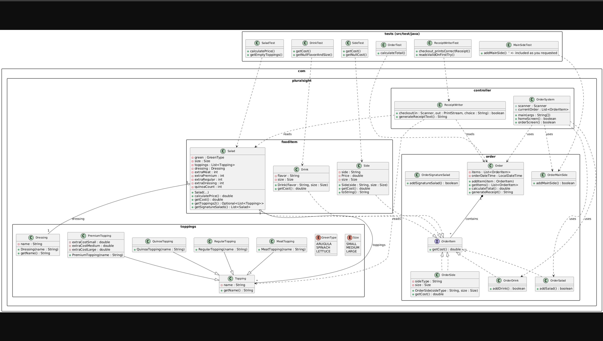
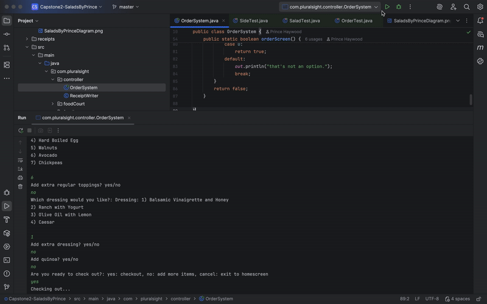
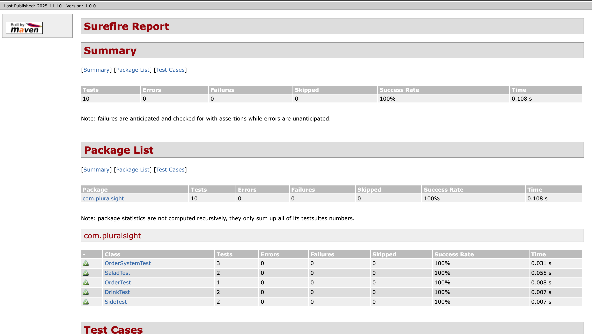
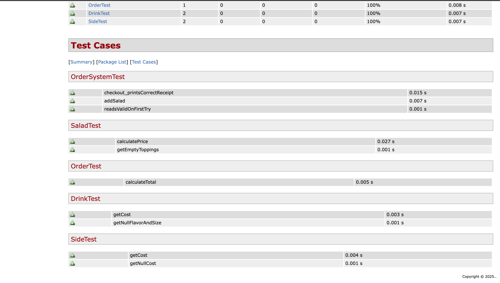

# 🥗 Salad's By Prince

A dual-interface meal ordering system.
Users can build custom salads, choose signature bowls, add sides, and drinks.
Includes:

* **Console-based ordering app**
* **Spring Boot Web App** (Prince's Food Court) with HTML UI.

---

## 📚 Table of Contents

* [Features](#features)
* [How-It-Works-Console-App](#how-it-works-console-app)
* [How-It-Works-Web-App](#how-it-works-web-app)
* [Class Diagram Overview](#class-diagram-overview)
* [Installation/Run Instructions](#installation/run-instructions)
* [Screen Gifs](#-screen-gifs-)
* [Interesting Code Snippet](#-interesting-code-snippet)
* [Test Reports](#test-reports)
* [Author](#author)
* [References](#references)

---

## 🧠 Features

* ✅ Build-your-own salad workflow
* 🥗 Pre-made signature salad menu
* 🍟 Add sides (ex: Sweet Potato, Kimchi, Roasted Tomato)
* 🥤 Drink selection
* 💾 Order summary and checkout
* 🌐 Optional Web UI via Spring Boot + Thymeleaf

---

## ⚙️ How It Works (Console App)

1. User selects Signature Salad **or** Custom Salad
2. If Custom:
    * User chooses greens
    * User adds toppings
    * User selects dressing
3. User optionally adds sides and drinks
4. Final order summary prints
5. An individual receipt is saved to a receipts file

---

## 🌐 How It Works (Prince's Food Court Web App)

1. Spring Boot serves a Thymeleaf-driven HTML menu
2. Menu items displayed visually
3. Orders stored in session
4. User checks out from browser
5. Prints PDF receipt

---

## 🧩 Class Diagram Overview




---

## 🛠️▶️ Installation/Run Instructions

### Installation

Clone the repository:
```
git clone https://github.com/praytoo/Capstone2-SaladsByPrince
cd Capstone2-SaladsByPrince
```
Build the project using Maven:
```
mvn clean install
```
Ensure Java 17+ is installed.

### Run

### Console App

```
cd SaladByPrinceConsole
mvn compile
mvn exec:java
```

### Spring Boot Web App

```
cd PrincesFoodCourtWebApp
mvn spring-boot:run
```

Visit:

```
http://localhost:8080
```

---

## 🖼️ Screen Gifs 

Console Menu:


Web Menu:


---

## 💡 Interesting Code Snippet

```
//signature salad list
    public static List<Salad> getSignatureSalads() {
        List<Salad> list = new ArrayList<>();

        Salad balsamicHoney = new Salad(
                Size.SMALL,
                GreenType.ARUGULA,
                new ArrayList<>(List.of(new PremiumTopping("Beef"), new RegularTopping("Raisins"))),
                new Dressing("Balsamic Vinaigrette and Honey"));
        list.add(balsamicHoney);

        Salad chickenCaesar = new Salad(
                Size.SMALL,
                GreenType.LETTUCE,
                new ArrayList<>(List.of(new PremiumTopping("Chicken"), new RegularTopping("Croutons"))),
                new Dressing("Caesar"));
        list.add(chickenCaesar);

        Salad oliveOil = new Salad(
                Size.SMALL,
                GreenType.SPINACH,
                new ArrayList<>(List.of(new PremiumTopping("Tuna"), new RegularTopping("Avocado"))),
                new Dressing("Olive oil and Lemon"));
        list.add(oliveOil);

        return list;
    }
```
Why it's interesting: This snippet shows how the backend of the app dynamically allows you to add a signature salad to your order. I didn't have to make a new class for Signature Salad that extended Salad by making signature salad static, so the backend of my app adds a signature salad with compiling ease.


---

## 🧪 Test Reports (JUnit)




---

## 👨‍💻 Author

**Prince Haywood**
📍 Playa Vista, California

## 📚 References

Van Putten, M. (2025, November 8th). CLI input and JUnit testing guidance. [Example JUnit Test]. https://github.com/BrightBoost/learningjava/commit/8295b216d59c4bc62dcedf8eb8d6a0ccf76b152b Year Up United.

OpenAI. (2025). ChatGPT (GPT-5) [Large language model]. https://chat.openai.com/ Example code and Spring Boot + Thymeleaf implementation assistance.

Mailjard, R. (2025). Capstone project structure checklist. [Advanced Java OOP – Capstone 2: Custom Food Shop Checklist] https://gist.github.com/RemseyMailjard/e9ab857ca4f92459f40de6d0b75b57fb Year Up United.
